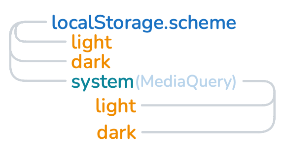

# svelte-color-scheme
  **_A library for managing light and dark mode for a sveltekit site._**

## Summary
  When you create a SchemeState instance ( provided in a svelte context )
  that instance uses a svelte MediaQuery, the browser's localStorage,
  and svelte reactivity to track both the visitor's system scheme preference
  and their preference on your site to update the current scheme.  

  

## Expected Default Behavior
  1) First time visitors will get their system's current scheme.
  1) Setting the site state to 'light' or 'dark' will override their system preference.
  1) When the site state is set to 'system' the site will honor their system setting preference.
  1) Any change to either the site or system preference will cause the value
  of the SchemeState instance's `.current` property to update. 
  
## Options
  1) The behavior of defaulting to the system preference can be overriden.

  `createSchemeState({ default: 'dark' })` and using a custom svelte:head with a fn to
  prevent a Flash Of Unwanted Content that updates the classlist or dataset to dark will
  mean that your site defaults to dark mode but the user can override it to be light or
  follow their system.
  
  2) What happens when the SchemeState instance's `.current` property is updated is
  entirely up to you. Put it in an `$effect` or `{}` and your ui will change accordingly.
  
## Installing
  ### npm
  ```npm install svelte-color-scheme```

  ### pnpm
  ```pnpm install svelte-color-scheme```

## Provides

  1) `createSchemeState()` - a fn that creates the context and instantiates SchemeState.

  1) `getSchemeState()` - a fn that retrieves the SchemeState instance from the context.

  1) a `<SchemeDatasetHeader />` - an optional component to add an iife to `<svelte:head>` on
  first load that will set a data attribute called scheme on the html element.
  This is to prevent a FOUC.

  1) a `<SchemeClassHeader />` - an optional component to add an iiffe to `<svelte:head>` on
  first load that will add a dark class to the html element. This is to prevent
  a FOUC.
   
## How to use svelte-color-scheme in your sveltekit project

in the script of +layout.svelte (presumably the root level):
  1) import the createSchemeState function
  1) call `createSchemeState()`
  1) import and add the SchemeDatasetHeader or SchemeClassHeader component or
  write your own logic to prevent FOUC and include it here. _These components are
  merely provided as a convenience based on two strategies for implementing light/dark mode._

in a scheme selecting component of your own making:
  1) import the getSchemaState function
  1) call `const scheme = getSchemeState()`
  1) wire up the ui to the state (see examples)
  1) watch the scheme change in all open tabs :)
  

## How to run the examples
  1) clone this repo to a folder on your system
  1) cd into the directory
  1) ```npm install``` or ```pnpm install```
  1) ```npm run dev --open``` or ```pnpm run dev --open```
  1) interact with the button and the slider to see the scheme change
